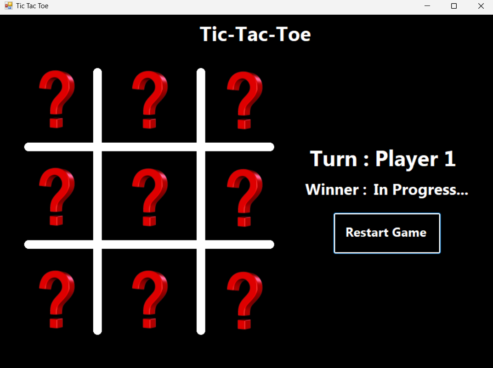
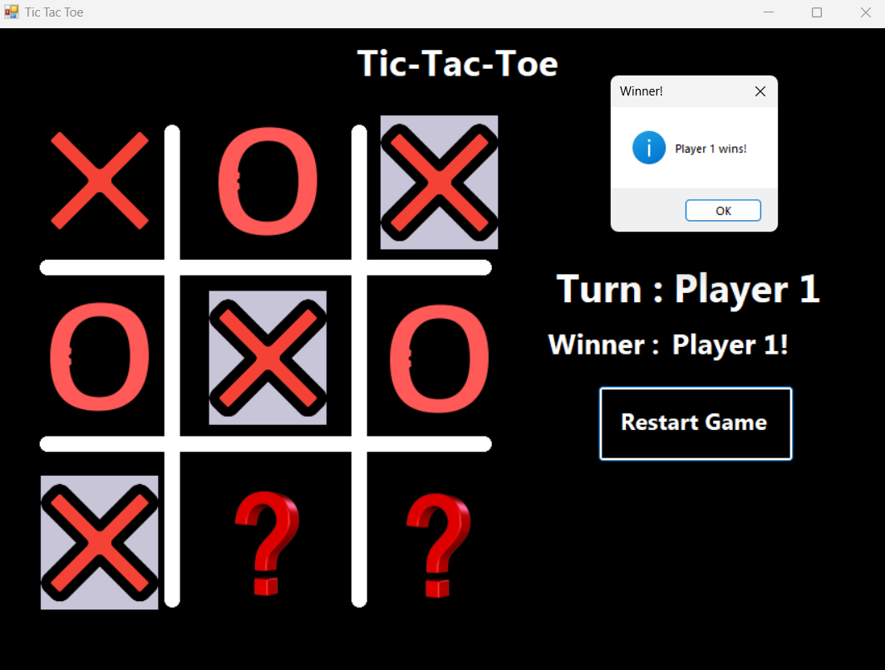
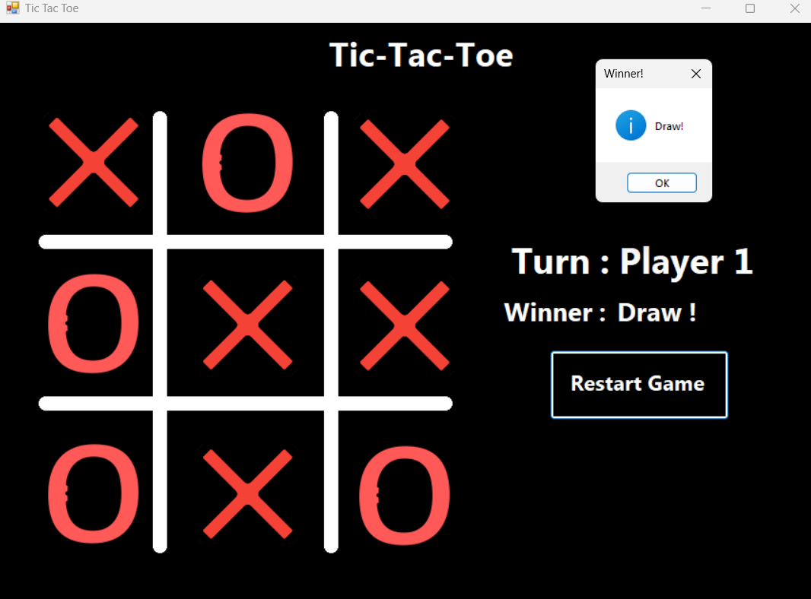

# Tic-Tac-Toe Game

This is a simple implementation of the classic Tic-Tac-Toe game using Windows Forms in C#. Players take turns marking spaces in a 3x3 grid, aiming to get three of their marks in a row (horizontally, vertically, or diagonally) before the opponent does.

## Features

- Two-player gameplay: Players take turns clicking on empty spaces to place their mark (X or O).
- Win detection: The game automatically detects when a player achieves three marks in a row and declares them as the winner.
- Draw detection: If all spaces are filled and no player has won, the game declares a draw.

## Screenshots

*Figure 1: Gameplay*

*Figure 2: Winner Announcement*

*Figure 2: Draw Announcement*

## Getting Started

### Prerequisites

- Visual Studio (or any other C# IDE) installed on your system.

### Installation

1. Clone the repository to your local machine.
2. Open the project in Visual Studio.
3. Build and run the project.

## Usage

- Launch the application.
- Player 1 starts the game, placing X marks.
- Player 2 follows, placing O marks.
- The game continues until one player wins or all spaces are filled.
